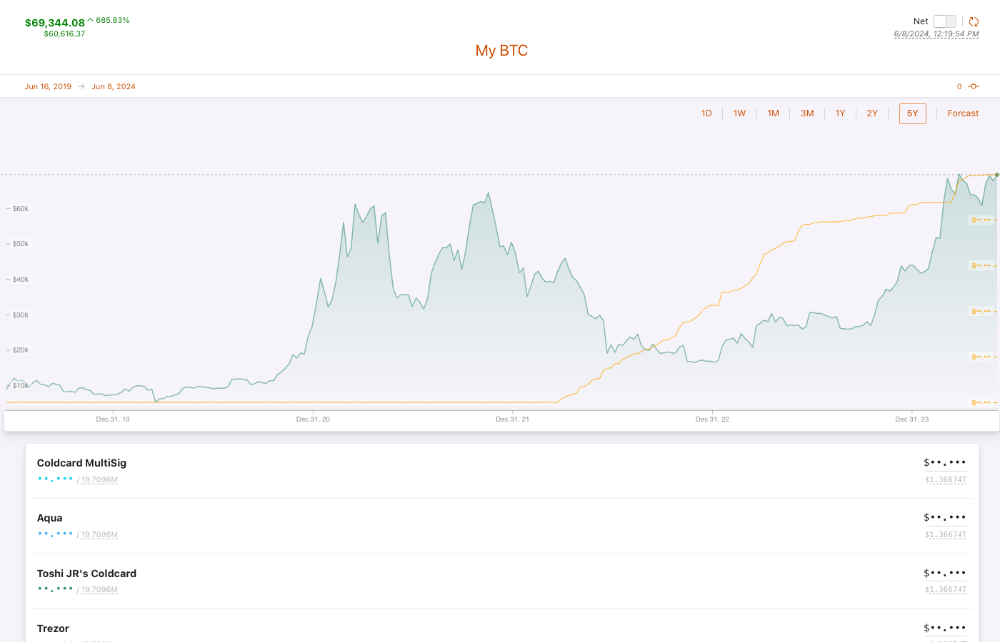
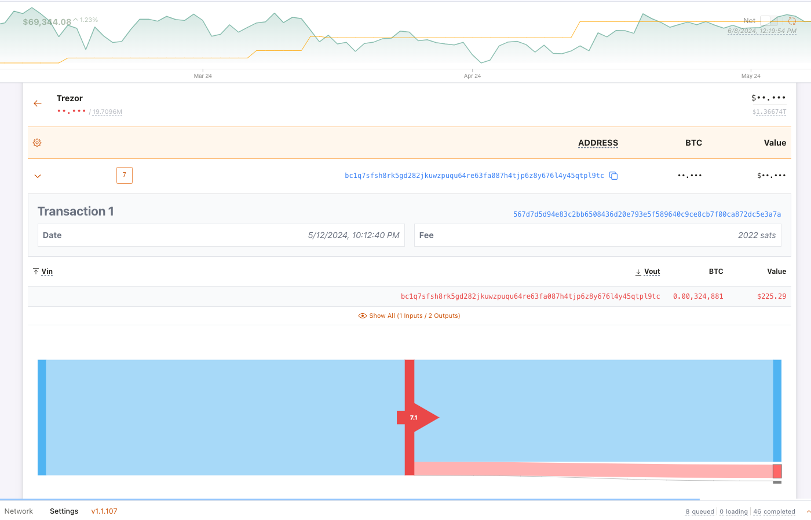
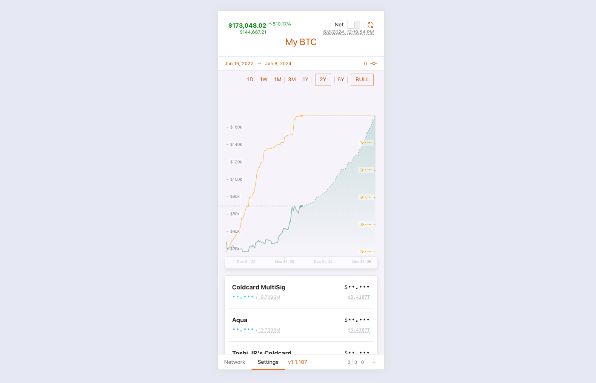
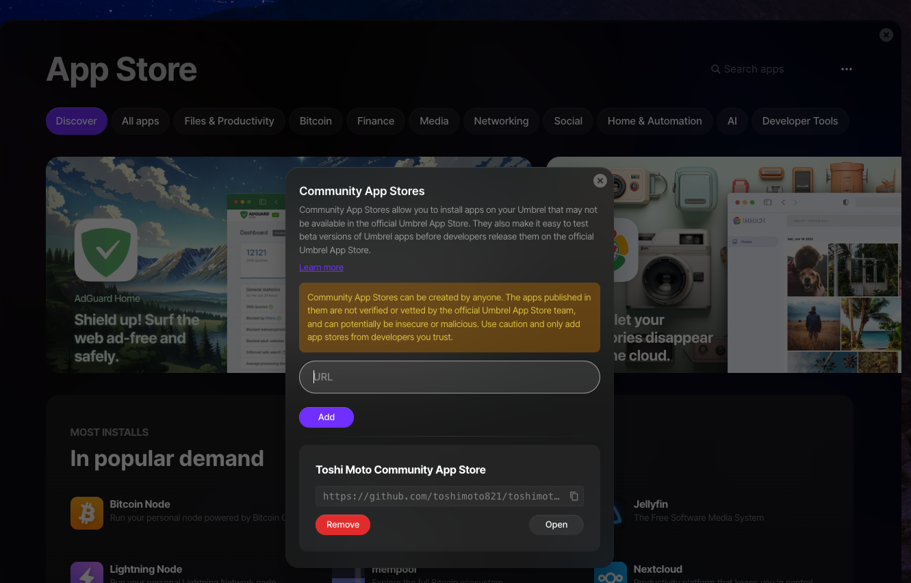

# Toshi Moto


[https://toshimoto.app](https://toshimoto.app)

Toshi Moto is a watch only bitcoin wallet aggregator.

# Screenshots



---



---



## Application Architecture


## Development

This repo contains a git submodule so you need to clone it like below with the following flag:

### Cloning this repo

```bash
git clone --recurse-submodule git@github.com:toshimoto821/toshi-moto.git
```

### Install and start

This repo uses a pnpm workspace:

```
pnpm install
pnpm dev
```

## Umbrel

I have yet to submit this app to the official Umbrel App Store. However, you can install it on an Umbrel using the a [toshi-collection community-app store](https://github.com/toshimoto821/toshimoto-app-store).

copy and paste the url below to "Add" and then select "Open"

```text
https://github.com/toshimoto821/toshimoto-app-store
```



# Developer Setup

How to run the app locally

```bash
npm run dev:mongo # start the mongo db
npm run dev:api # start the api
npm run dev:ui # start the ui
```

## License

vn
This software is licensed under the PolyForm Noncommercial 1.0.0 license. TL;DR — You're free to use, fork, modify, and redistribute it for personal and nonprofit use under the same license.


