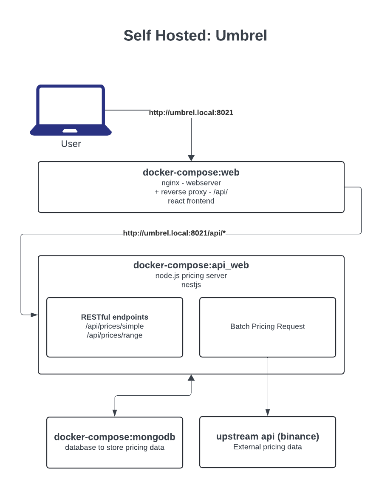

# Toshi Moto

[https://toshimoto.app](https://toshimoto.app)

Toshi Moto is a watch only bitcoin wallet aggregator.

# Screenshots

Desktop:


Mobile:


## Application Architecture




## Development

This repo contains a git submodule so you need to clone it like below with the following flag:

### Cloning this repo

```bash
git clone --recurse-submodule git@github.com:toshimoto821/toshi-moto.git
```

### Install and start

This repo uses a pnpm workspace:

```
pnpm install
pnpm dev
```

## License

This software is licensed under the PolyForm Noncommercial 1.0.0 license. TL;DR — You're free to use, fork, modify, and redistribute it for personal and nonprofit use under the same license.


